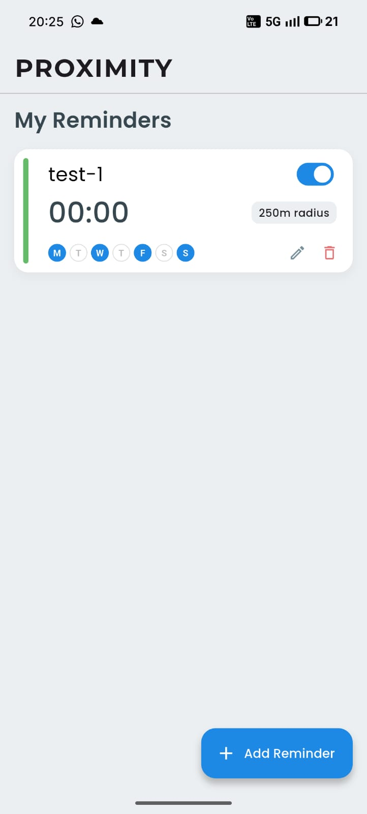
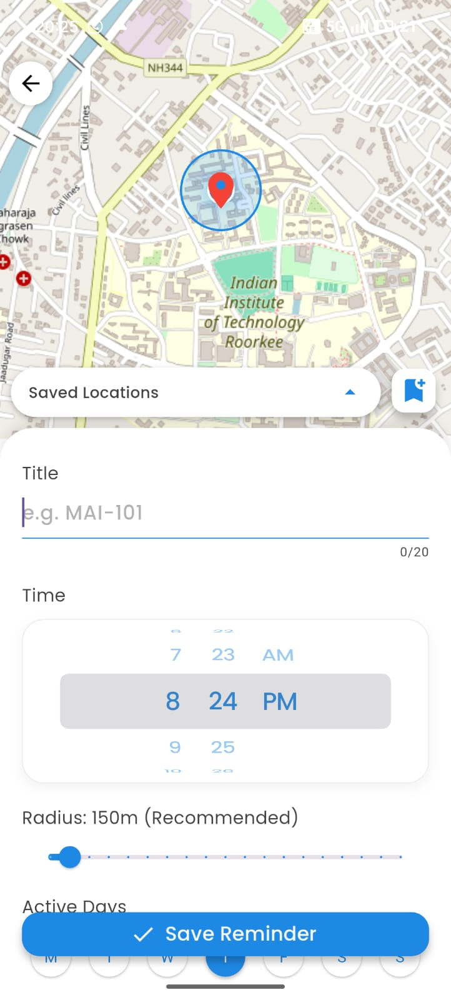

# Proximity 📍
**A Location-Based Reminder App built with Flutter.**

Proximity is a smart task manager that triggers reminders not just by time, but by **location**. Whether you want to reach your classes on time or don't want to miss your train while at the same time preventing any embarrassment caused by an alarm ringing mid-class.

## ✨ Features
* **📍 Location-Based Triggers:** Reminders fire when you enter a specific geofenced area.
* **🗺️ Interactive Map:** Built using OpenStreetMap (OSM) for precise coordinates.
* **⭕ Adjustable Radius:** Set a custom trigger distance (100m to 1km).
* **💾 Saved Locations:** Save frequent spots (e.g., Hostel, Gym) for quick access.
* **⚙️ Background Service:** Checks location even when the app is closed.
* **📂 Persistent Storage:** All data is saved locally using **Hive**.
* **🎵 Custom Alarms:** Supports custom audio files for notifications.

## 📸 Screenshots
|  |  |

## 🛠️ Tech Stack
* **Framework:** Flutter (Dart)
* **Database:** Hive (NoSQL)
* **Maps:** `flutter_map` (OpenStreetMap)
* **Background Tasks:** `android_alarm_manager_plus`

## 📲 Installation

### Option 1: Download the APK (Easy Way)
You don't need to build the code yourself!
1.  Click on the **Actions** tab at the top of this repository.
2.  Click on the latest successful workflow run (look for the green ✅ checkmark).
3.  Scroll down to the **Artifacts** section at the bottom.
4.  Click on `app-release` (or `flutter-apk`) to download the zip file.
5.  Extract the zip and install the `.apk` file on your Android device.

*(Note: You must be logged into GitHub to download Artifacts.)*

### Option 2: Build from Source (For Developers)
1.  **Clone the repository**
    ```bash
    git clone [https://github.com/KeshavBansal42/Proximity](https://github.com/KeshavBansal42/Proximity)
    ```
2.  **Navigate to the project**
    ```bash
    cd proximity
    ```
3.  **Install Dependencies**
    ```bash
    flutter pub get
    ```
4.  **Run the App**
    ```bash
    flutter run
    ```

## ⚠️ Permissions
Please allow **"Location: Allow all the time"** for background triggering to work.

## 👤 Author
**Keshav Bansal**
* **Institution:** IIT Roorkee
* **LnkedIn:** [**Keshav Bansal**](https://www.linkedin.com/in/keshav-bansal-559788372/)
